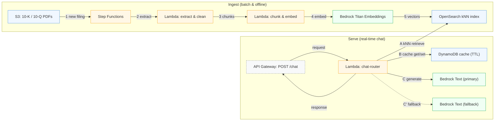

# SEC Filings RAG Copilot (serverless, low-cost)

A production-style Retrieval-Augmented Generation (RAG) system that ingests 10-K/10-Q filings and answers questions with citations.

**Stack**: AWS S3, Step Functions, Lambda, Bedrock Titan Embeddings, OpenSearch, DynamoDB TTL Cache, API Gateway

**Architecture:**

Features:

Low-cost, serverless RAG on AWS

DynamoDB cache to reduce LLM calls

Public API Gateway endpoint

Easily extensible to other document sets

Deployment
See DEPLOY.md for AWS setup instructions.

